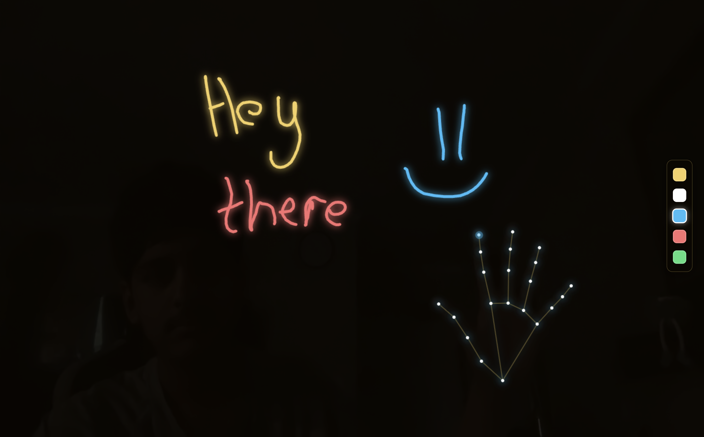

---

# Hand Ink

## About the Project
Hand Ink is a project I made. It’s a hand tracking drawing app that lets you write in the air using your finger. It’s made with MediaPipe Hands and tracks your fingertip movement in real time to create glowing writing directly on the screen. 

One thing you might notice is that the drawing pointer doesn't stay  attached to your fingertip, Instead it smoothly follows it. I chose this  because it reduces small jitters from hand tracking, making writing and drawing feel much smoother and more natural.

---

## How It Works

- Uses webcam input to detect hand landmarks
- Tracks the index fingertip in real time
- Draws lines following finger movement
- Built using MediaPipe hand tracking and computer vision techniques

---

## How to Use

1. Allow camera access when prompted  
2. Hold the SHIFT key to start drawing  
3. Move your finger to draw in the air  
4. Press SPACEBAR to clear the screen  

